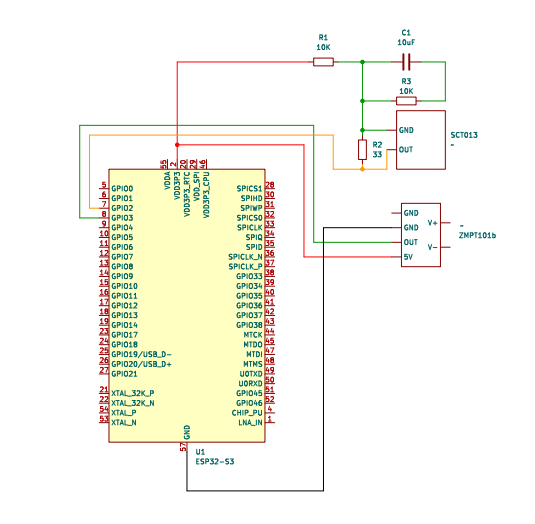
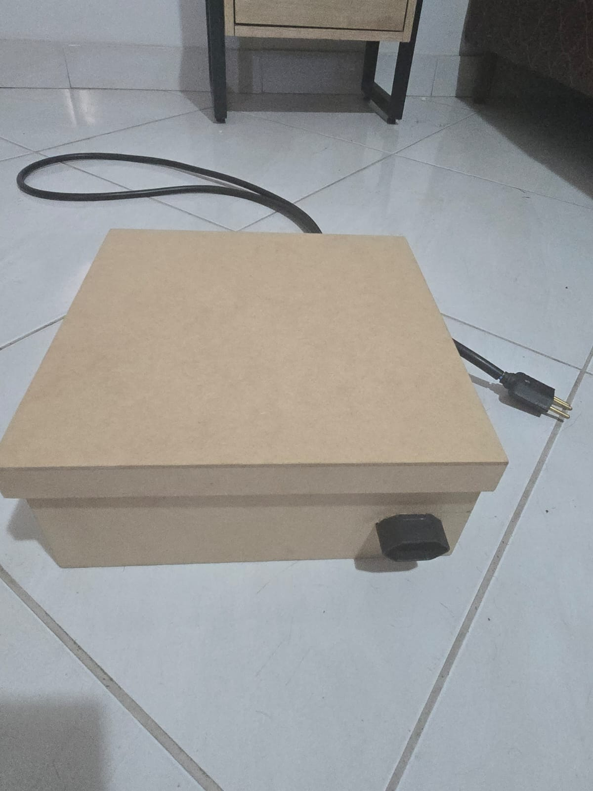
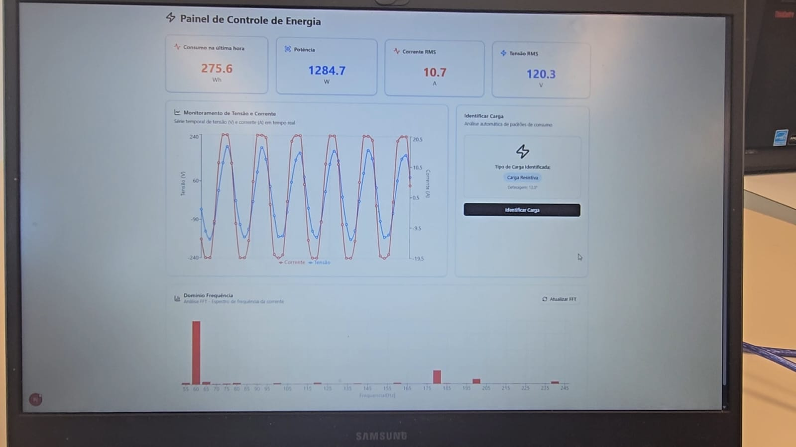

# RT-Electrical-Measurement

[]()
[]()
[]()
[]()

## 📌 Overview
This project presents the development of a smart energy meter for real-time electrical measurement and monitoring capable of identifying the nature of electrical loads connected to the grid (resistive, inductive, capacitive) and performing real-time measurements.

The system was designed to be robust, low-cost, and adaptable, integrating IoT, digital signal processing, and spectral analysis. It features a web-based frontend, a backend server, and ESP-based firmware.

This project was developed as part of the [Integrated Computer Project II](https://computacao-ufes.github.io/mostra/pic2_EC_20251.html) course at the Federal University of Espírito Santo (UFES)

## ✅ Features

- Real-time electrical parameter monitoring (voltage, current, etc.)
- Web dashboard for live data and historical trends
- Wireless communication between hardware and frontend

## ⚙️ System Architecture

### 🔧 Hardware
- **ESP32-S3** (dual-core, Wi-Fi, Bluetooth, FreeRTOS).
- **ZMPT101b voltage sensor**.
- **SCT-013 current sensor** (non-invasive).
- Auxiliary circuit (resistive divider + coupling capacitor).
- Wooden enclosure with power extension for user connection.

⚙️ **Circuit Schematic**  



📷 **Hardware Assembly**



### 💻 Embedded Software (ESP32-S3 + FreeRTOS)
- Simultaneous acquisition of voltage and current.
- Multithreading for concurrent measurements + synchronization.
- Data sent in **JSON** format to a central server.

```bash
appr1.ino 
```
- ESP32 code for interfacing with electrical sensors and transmitting measurements to the back-end.

### 🌐 Server
- API built with **Django (Python)**.
- **PostgreSQL** database.
- Data processing:
  - Calculation of **RMS values**.
  - **Energy consumption (Wh)**.
  - **FFT** for spectral analysis.
  - Phase shift calculation for load classification.

```bash
backend/
```  
- Server-side code handling sensor data acquisition, processing, and communication with the front-end.

### 📊 Front-End
- Developed in **React + TypeScript**.
- Features:
  - Displays RMS values, instantaneous power, and consumption.
  - Waveform plots and FFT spectrum.
  - Automatic classification of loads (**resistive, inductive, capacitive**).

📷 **Front-End Dashboard**  



```bash
frontend/
```
- React-based web application for real-time data visualization.

## 📋 Getting Started

1. **Clone the repository**
     ```bash
     git clone https://github.com/joaoBatista04/RT-Electrical-Measurement.git
     ```

2. **Frontend**
     - Navigate to `frontend/`
     - Install dependencies: `npm install`
     - Start development version with `npm run dev`

3. **Backend**
     - Navigate to `backend/`
     - Install dependencies and configure settings as needed
     - Make sure you have installed and configured your database (PostgreSQL in this case)
     - Run `python manage.py makemigrations` followed by `python manage.py migrate` to make sure your database is properly setup
     - Start the backend server: `python manage.py runserver 0.0.0.0:8000`

4. **ESP Firmware**
     - Open `appr1.ino` in Arduino IDE
     - Properly configure Wi-Fi connection and correct server IP
     - Select the correct ESP board and port
     - Upload to your ESP32 device

## ⚠️ Requirements

- Node.js & npm (for frontend)
- Django & Python (for frontend)
- ESP32-S3 board

## 📄 Demonstration and Technical Documentation

For a real demonstration of how the project works, watch the video at this [link](https://www.youtube.com/watch?v=vYOW8ARHUHc).

To access more detailed technical documentation, please follow this [link](https://drive.google.com/file/d/1U-4NNh6PsUmvGDHcrbZJpTy9ABmsuzRb/view?usp=sharing).

## 👨‍💻 **Authors**:  
- Arthur Trarbach - [@TrarbachArthur](https://github.com/TrarbachArthur)
- David Marques - [@DavidMarquesss](https://github.com/DavidMarquesss/)  
- João Pedro Batista – [@joaoBatista04](https://github.com/joaoBatista04)  